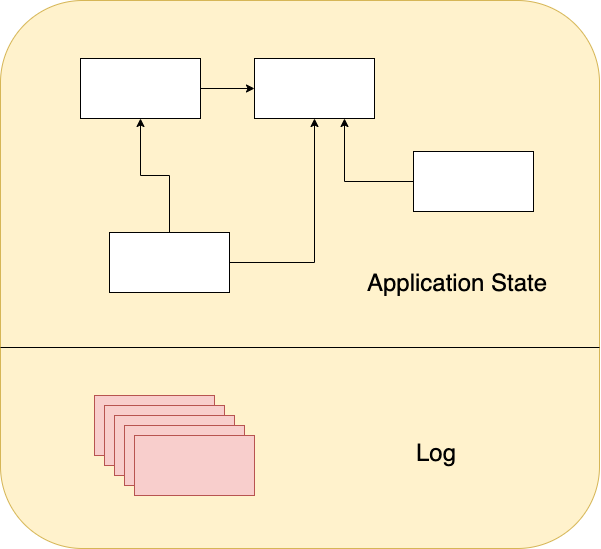
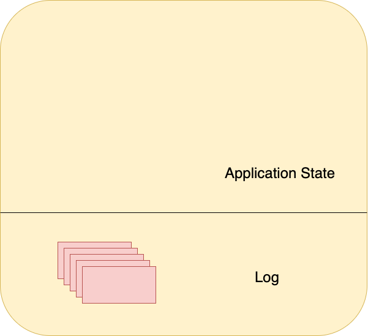
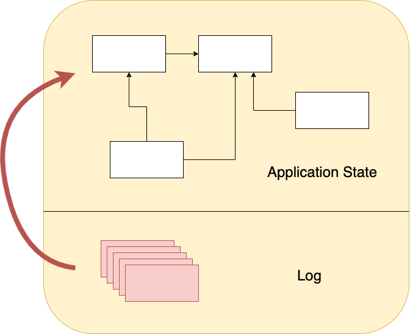

---
revealOptions:
    transition: 'slide'
---

# Event Sourcing

<small>by: Silas Baronda</small>

---

# Reviewing the classic system

Note: Let's review the classic system that we have today

---

# Characteristics

1. Read and write both go through the same layers
2. We use the same model for read and write access
3. We change data directly

Note: read slides first. This isn't wrong and this works nicely for some applications. It's a proven technology.  We very good reasons for doing the things we been doing, but there might be some drawbacks to this kind of architecture.

---

# Drawbacks

* CRUD systems perform update operations directly against a data store, which can slow down performance and responsiveness, and limit scalability, due to the processing overhead it requires.
* In a collaborative domain with many concurrent users, data update conflicts are more likely because the update operations take place on a single item of data.

---

* Unless there's an additional auditing mechanism that records the details of each operation in a separate log, history is lost.

---

# What is Event Sourcing

---

> [...] handling operations on data that's driven by a sequence of events, each of which is recorded in an append-only store. Application code sends a series of events that imperatively describe each action that has occurred on the data to the event store, where they're persisted. Each event represents a set of changes to the data (such as `AddedItemToOrder`).


Note: Event sourcing is an architecture pattern in which the state of the application is being determined by a sequence of events

---



Notes: with event sourcing we divided our application source of the knowledge of the world into two parts, the application state, which is the current state of the world, and the log of events, everything thing that happend to change that world.

---



Note: Any time we can blow away the state of the application and replay from the event log and rebuild the application state.

---



Note: We can always go back to the events. The event source the fundlemental source of truth.

---


[Microsoft](https://docs.microsoft.com/en-us/azure/architecture/patterns/event-sourcing)

Note: Materialized view can be considered a snapshot of the aggregate (a way to not require creating replay the events to get the current world state of the aggregate or the domain).  When you see Materialized view, aggregate, snapshot, projection they all mean the same thing in this presentation.  They refer to the thing, the current state of the domain.

---

### The Benefits

---

- Ephemeral Data-Structures and the ability to take the existing events and view them in a new way
- Easier communication with domain experts - these events are part of the Ubiquitous language used
- Matches what we are currently modeling
- Reports becomes dead simple-you have a time machine
- Audit log / Historic state
- Event system-being reactive to events
- Replay events on a staging / development machine-debuggablity

Notes: with event sourcing you don't need to do migrations and simple create a new projection with the existing events and discard the old projection

---

Drawbacks

- Eventual Consistency-event gets created and other systems won't hear about it immediately
- Event upgrading
- New line of thinking-from CRUD to events

---

> You don't need to implement every single Event Sourcing pattern to have an "Event Sourced" system

[fagnerbrack](https://news.ycombinator.com/item?id=19073559)

---

> Basic event sourcing is quite simple to implement. All the bells and whistles people sell alongside event sourcing are hard - whether you do event sourcing or not.

[codebje](https://news.ycombinator.com/item?id=19073699)

---

> Event sourcing is REALLY hard to figure out how to do “right.” A lot of getting it right is modeling knowledge/experience, understanding your domain.

[linkmotif](https://news.ycombinator.com/item?id=19073279)

Notes: I could go on and on. From what I've read there seems to be a couple different ways that you can do event sourcing. My takeaways are to start small and only include what you need.

---

### Three different architecture patterns:

1. event sourcing (build your models based on immutable facts)
2. event driven (side affects triggered by messages, often delivered by queues)
3. workflow

Notes: I'm going to take you through a simple event sourcing system that uses code that was published in a blog post from Kickstarter.  The link for the blog post will be in the references section below.

---

# 1. Event sourcing / Events

Notes: building models based on immutable facts

---

The names of events are part of the Ubiquitous Language, part of DDD

Notes: These are immutable facts that have happened in the past.

---

Good names

- `ItemAdded`
- `CartCheckedOut`
- `CustomerCreated`

Bad Names

- `CreateCustomer`
- `StartCart`
- `AddItem`

Note: These are bad because they are command style syntax.  A command does not indicate that something has been commemorated. Let's checkout an example of a event in code.

---

Event Example

<pre class=""><code data-trim data-line-numbers="1-2|3|5|6-9">
class Events::Subscription::Activated < \
  Events::Subscription::BaseEvent
  data_attributes :stripe_key

  def apply(subscription)
    subscription.stripe_key = stripe_key
    subscription.status = "active"
    subscription.activated_at = self.created_at
    subscription
  end
end
</code></pre>

Note: In our example above, this code does two things, hold event data, and handle building the aggregate. data_attributes defines setters and getters for the attributes passed in. They will all get stored in the data column. These attributes are what make up our event.  The apply function is a calculator and changes the aggregate / materialized view /  snapshot / projection.

---

What these events might look like in when stored


---

Aggregates

* Current state of the world
* Event Data + `apply` (Calculator) => Aggregate
* The "thing" that most other domains will interact with
* Materialized view, projection, snapshot, cached data....

Note: next in this system is the ability to take these events and produce an aggregate.  The aggregate produced is our rails model.

---

```
class Subscription < ApplicationRecord
  belongs_to :user
  belongs_to :reward
  has_many :events
end
```

<pre class=""><code data-trim data-line-numbers="1|2-6|7">
subscription = Subscription.find(12)
Events::Subscription::Activated.create!(
  subscription: subscription,
  stripe_key: "sub_66123",
  metadata: { notification_id: 33456 }
)
subscription.activated? # => true
</code></pre>

Note: the great thing about this method is that we create the event and the aggregate at the same time.  This allows us to feel very Rails like and gives us an easy escape route if we didn't need events for this model anymore or we didn't find this pattern useful.  This is one of the big reasons why I decided to study this framework.

---

What these aggregates might look like when stored


---

# 2. Event driven

Notes: At this point you could stop at just events and have a lot of success.  This next section being able to react to events.

---

# Reactors and dispatchers

---

We react to events with `reactors` via the `dispatcher`

<pre class=""><code data-trim data-line-numbers="1|3-4|7-8">
class Dispatcher
  # ...
  on Events::Subscription::Activated,
    async: Reactor::Notifications::SubscriptionConfirmation
  on Events::Subscription::Activated,
    async: Reactor::Notifications::NewSubscriberNotification
  on Events::Subscription::Activated,
    trigger: ....
  # ...
end
</code></pre>

Notes: Behind the scenesthese are just Sidekiq jobs in our system. This supports both async and synchronously reactors where synchronously reactors triggering events that update related records.

---

Reactor - can be triggered async or synchronous

```
class Reactors::Notifications::SubscriptionConfirmation
  def self.call(event)
    SubscriberMailer.confirm_subscription(
      subscription_id: event.subscription_id
    ).deliver
 end
end
class Reactors::Notifications::NewSubscriberNotification
  def self.call(event)
    CreatorMailer.queue_new_subscriber(
      subscription_id: event.subscription_id
    ).deliver
  end
end
```

Note: These happen after the event has been saved and are triggered via an `after_commit`

---

# 3. Workflow - Commands

Not part of Event Sourcing, but is a nice additional pattern.

Note: kickstarter called these commands, but I don't think they follow the textbook term

---

### Commands

Responsble for:

- Validating attributes
- Validating that the action can be performed given the current state of the application
- Building and persisting the event

---

<pre class=""><code data-trim data-line-numbers="1|2|3|7-11|13-15">
class Commands::Subscription::Activate
  include Command
  attributes :subscription, :stripe_key, :metadata
  validate stripe_key, presence: true

  def build_event
    Events::Subscription::Activated.new(
      subscription: subscription,
      stripe_key: stripe_key,
      metadata: metadata
    )
  end
  def noop?
    subscription.activated?
  end
end
</code></pre>

Note: The command above will be a noop (it won’t create an event) if the subscription is already activated.

---

```
Commands::Subscription::Activate.call(
  subscription: subscription,
  stripe_key: "sub_66123",
  metadata: { notification_id: 33456 }
)
# => <#Events::Subscription::Activated ...>
```

---

Back to events and how they apply

<pre class=""><code data-trim data-line-numbers="1|2|4|6|9|12|13">
class BaseEvent
  before_save :apply_and_persist
  ....
  private def apply_and_persist
    # Lock! (all good, we're in the ActiveRecord callback chain transaction)
    aggregate.lock! if aggregate.persisted?

    # Apply!
    self.aggregate = apply(aggregate)

    # Persist!
    aggregate.save!
    self.aggregate_id = aggregate.id if aggregate_id.nil?
  end
end
</code></pre>

---

# Demo

---

# Questions

---

## Resources / Want to learn more

* [These slides/demo application](https://github.com/silasb/event-sourcing-presentation)
* [A short talk from Martin Fowler that explains the concepts really well](https://www.youtube.com/watch?v=aweV9FLTZkU)
* [Kickstarter blog post](https://kickstarter.engineering/event-sourcing-made-simple-4a2625113224)
* [Kickstarter example application](https://github.com/kickstarter/event-sourcing-rails-todo-app-demo)
* [Blog post that explains Kickerstarter blog post](https://dev.to/isalevine/building-an-event-sourcing-pattern-in-rails-from-scratch-355h)
* [Accompanying repo from the above blog post](https://github.com/pcreux/event-sourcing-rails-todo-app-demo)
* [Event Sourcing explained with diagrams](https://docs.microsoft.com/en-us/azure/architecture/patterns/event-sourcing)
* [Gradually migrating from CRUD to Event Sourcing](https://www.eventstore.com/blog/a-recipe-for-gradually-migrating-from-crud-to-event-sourcing)
